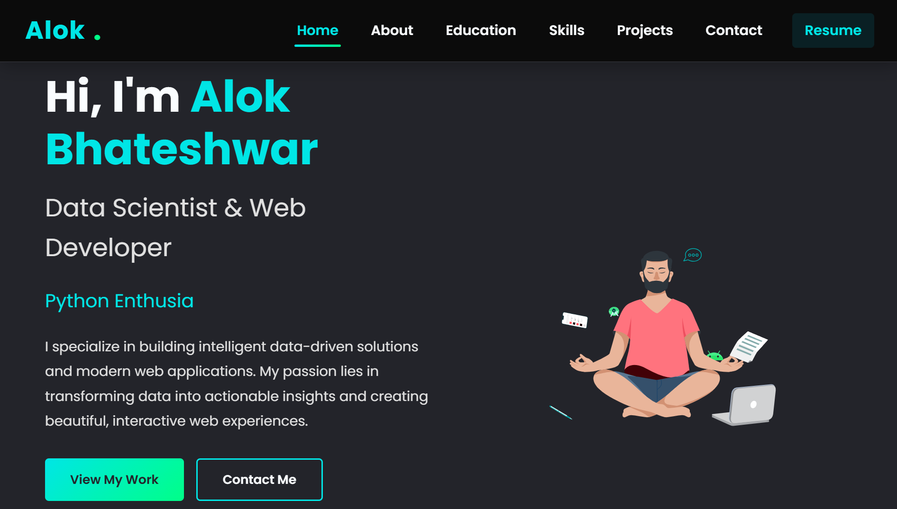

# 🌐 Alok Bhateshwar - Personal Developer Portfolio

Welcome to the source code for my **Personal Developer Portfolio Website**!  
This is a modern, fully responsive, and developer-focused portfolio built to showcase my **skills**, **projects**, **ATS-friendly LaTeX resume**, and **career journey** in **Software Development**, **Web Development**, and **Data Science**.

---

## 🖥️ Live Website Preview (Screenshot)

*This is a static screenshot preview. The live website features smooth animations, responsive layouts, and interactive UI elements.*

---

## 📌 Want to Use This Portfolio Template?

If you like this design, feel free to **fork this repository** and build your own personal portfolio!  
Simply replace my content, images, and links with yours.  
If you find it helpful, a ⭐️ star on this repo would mean a lot!

---

## 🔗 Live Portfolio Website

👉 [Click here to Visit My Live Website](https://alokbhateshwar.github.io/Personal-Portfolio/)

---

## 🚀 Key Features

- **📱 Fully Responsive Design:** Optimized for desktops, tablets, and mobile devices.
- **📂 Dynamic Project Showcase:** Project title, description, technologies used, GitHub link, and live demo link.
- **👨‍💻 About Me Section:** Summary of my background, skills, and developer journey.
- **📄 ATS-Friendly Resume (Auto-Generated with LaTeX):**  
A professional LaTeX-generated resume with a **90%+ ATS compatibility score**, making it recruiter and HR software-friendly.
- **✉️ Contact Section:** Direct links to LinkedIn, GitHub, Email, and a frontend contact form (UI ready for backend).
- **🌙 Dark Mode Ready (Optional):** Design is prepared for future light/dark theme toggling.

---

## 🛠️ Technologies Used

- **Frontend:** HTML5, CSS3, JavaScript
- **Styling:** Tailwind CSS, Bootstrap
- **Framework (Optional):** React.js
- **Resume Generator:** LaTeX
- **Deployment:** GitHub Pages  
*(Optional future deployment: Netlify / Vercel)*

---

## 🏷️ Repository Tags / Topics (GitHub SEO)

Portfolio, Personal Website, Developer Portfolio, Web Development, Frontend Development, React Portfolio, HTML, CSS, JavaScript, Tailwind CSS, Bootstrap, Responsive Design, GitHub Pages, Software Developer Portfolio, LaTeX Resume, ATS Friendly Resume, Single Page Application, Dark Mode, UI/UX Design, SEO Optimized Portfolio, Portfolio Template, Vite, Next.js, TypeScript, Resume Builder, Animated Portfolio.

---

## ✅ Planned Future Enhancements

- Backend form handling (Node.js / Firebase)
- API-driven project fetching
- Blog or Articles section
- Advanced SEO optimization (Structured Metadata + Open Graph tags)
- CI/CD deployment pipelines (GitHub Actions / Netlify Hooks)
- Dark/Light Theme Toggle Feature

---

## 🙌 Feedback & Contributions

Contributions, suggestions, and forks are always welcome!  
If you have ideas or improvements, feel free to **open an issue** or **submit a pull request**.

---

## 📜 License

This project is open-source and available under the **MIT License**.

---

⭐️ **Thank you for visiting my portfolio repository!**  
👉 **Live Website:** [https://alokbhateshwar.github.io/Personal-Portfolio/](https://alokbhateshwar.github.io/Personal-Portfolio/)
